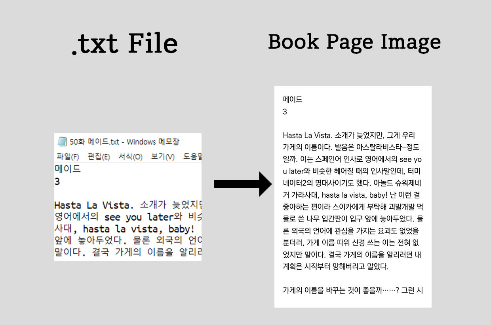

# Text-2-E-book-page
Make E-book pages from text file



## Requirements

need pillow, tqdm, python 3.7+

## How To Use
```
place your text files in
%text_directory%/"book name"/ch1.txt
                             ch2.txt
                             ...
then, 
python runner.py
```

## Config Index
```
[Font]
font_name - your font file name. (Default: 'KoPubWorld Dotum_Pro Medium.otf')
font_size - size of rendered text in pixel. (Default: 36)

[Page]
page_width - image width in pixel. (Default: 750)
page_height - image height in pixel. (Default: 1060)
margin - UDLR margin. (Default: 40)
min_character - minimum character in a row. bigger value makes processing faster but output can be wierd. (Default: 22)

[Color]
font_coolor - color of text in hex color. (Default: #000000)
page_color - color of background in hex color. (Default: #000000)

[Directory]
text_directory - directory of text files. (Default: ./Processing/ -> this means your text files in like ./Processing/"book name"/ch1.txt)
result_directory - directory of output images. (Default: ./Result/ -> this means your output images in ./Result/"book name"/ch1/*.png)

[Debug]
num_core - num of cores for processing. (Default: 4, if this value exceed your CPU's cores, it use your whole cores)
verbos - have no role.
```
